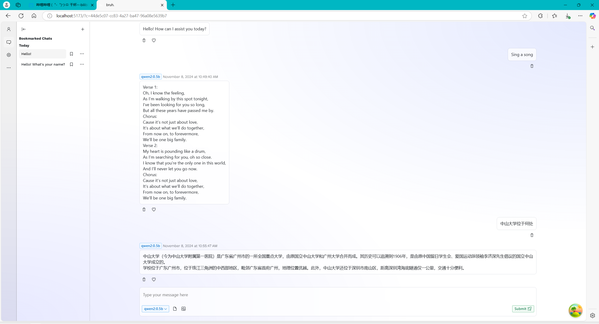

# GaussChat

**中山大学 2024 年数据库实验大作业**：基于 openGauss 实现的 LLM 多用户交互平台，构建一个支持多用户、具有对话历史管理功能的 LLM 交互平台，用户可选择不同的模型配置进行交互，平台提供可视化界面。

GaussChat —— OpenGauss-LLM-MultiUser-Chat-Platform

- 组长：许睿林
- 组员：傅小桐、戴俊腾



## 如何运行

### 前端

首先请您根据 `front/.sample-env` 创建 `front/.env` 文件。

```bash
cd front/
npm install
npm run dev
```

这将启动 Vite 开发服务器，默认情况下，您应该能够通过 `http://localhost:5173` 访问前端。

### 后端

首先准备 Python Django 运行环境

```bash
cd backend
pip install -r requiremens.txt
```

接着初始化后端数据库

```bash
python manage.py migrate
```

创建一个管理员账号

```bash
python manage.py createsuperuser
```

最后运行 Django 服务器

```sh
poetry run python manage.py runserver
```

这将启动 Django 开发服务器，默认情况下可以通过 `http://localhost:8000/admin` 访问后端管理员面板。

## 仓库架构

```Tree
GaussChat
├── assert
├── app
├── front
├── gauss
├── tools
├── LICENCE
└── README.md
```

- `assert`: 静态资源
- `app`: 后端代码
- `front`: 前端代码
- `gauss`: 数据库代码
- `tools`: 参考工具

## 系统架构

- 数据层：openGauss 数据库存储系统信息。

- 后端层：Python Flask 框架作为后端，提供 API 和业务逻辑。

- 前端层：Vue.js 实现交互式 WEB 界面，用户通过浏览器访问平台。

## 开发计划

- 数据层
    - [x] 本地部署
    - [ ] 数据库设计
    - [ ] 实现 Python 调用
    - [ ] 【可选】改用分布式存储架构，若做成，全班闻名
- 后端层
    - [x] 前后端接口设计
    - [x] 实现 LLM 调用
    - [ ] 实现数据库业务
    - [x] 实现后端接口
- 前端层
    - [x] 页面设计
    - [x] 实现静态页面渲染
    - [x] 实现动态信息渲染
    - [x] 实现前端接口
- LLM
    - [x] 本地部署

## 现有工具

1. `db-tools.py`: 此程序演示了如何获取本地 OpenGauss 数据库的所有使用权

2. `llm-tools.py`: 此程序演示了如何与本地 LLM 进行交互

## 更多信息

1. 开发环境

- CPU: 13th Gen Intel(R) Core(TM) i7-13700KF
- GPU: NVIDIA GeForce RTX 3060 * 2
- MEM: 32GB
- DISK: 1TB
- IP: 172.18.198.220(中山大学校园网内)
- USER: db-lab
- PASSWARD: sysu-db-user

2. OpenGauss

OpenGauss 是一款开源关系型数据库管理系统，本项目采用 Docker 进行 OpenGauss 部署

- 部署版本: 5.1.0
- 数据库名/DATABASE_NAME: GaussChat
- 用户名/USERNAME: db-lab
- 密码/PASSWARD: Db@00001
- 主机/IP: 127.0.0.1
- 端口/PORT: 15432

3. Ollama

ollama是一个简化大型语言模型本地部署的工具,本项目采用 Docker 进行 Ollama 部署

- 部署版本: 0.3.13

目前已部署模型:

- qwen2:0.5b

4. Vue.js

Vue.js 是一款用于构建用户界面的 JavaScript 框架

- Node.js 版本: 20.18.0(LTS)
- Npm 版本: 10.8.2
